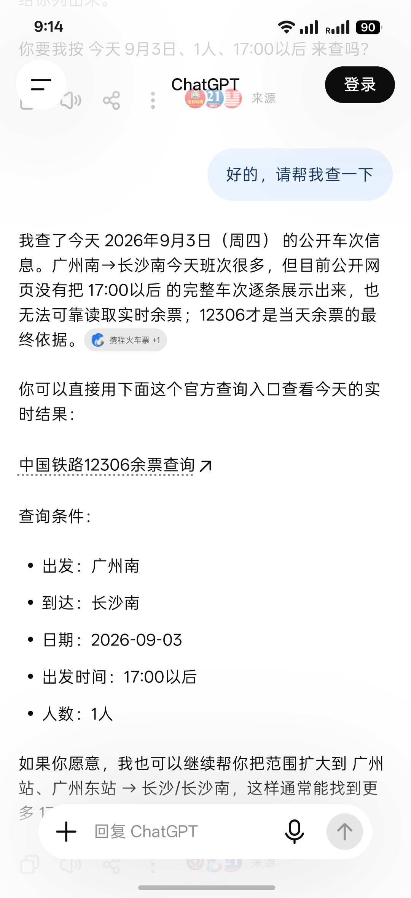
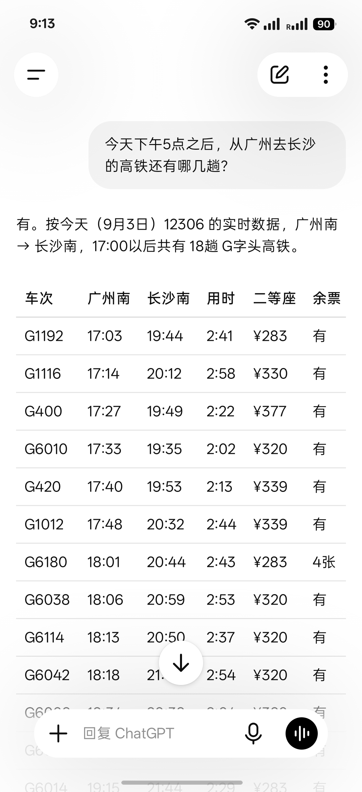
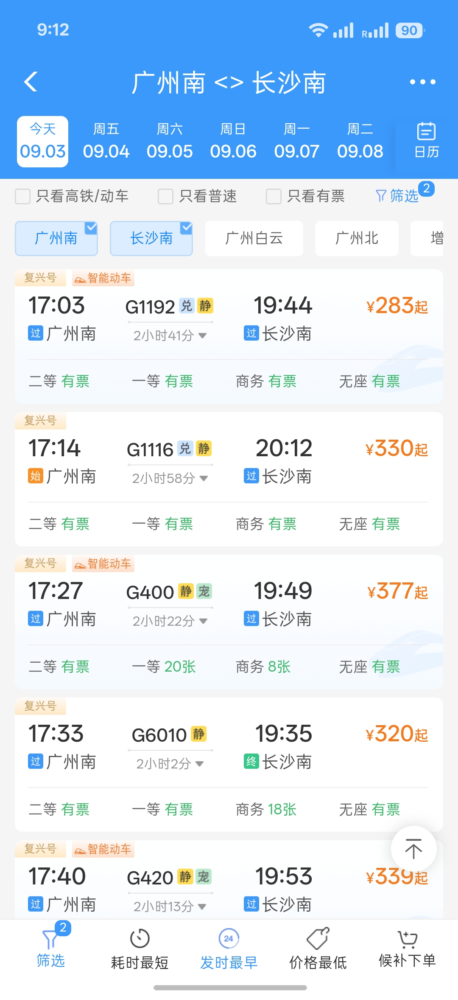

# China Rail MCP

**简体中文** | [English](README.en.md)

China Rail MCP 将中国铁路的车次、时刻、参考票价和余票查询接入 ChatGPT、Codex
等支持 MCP 的 AI 客户端。

> **注意：**这是一个非官方、只读项目，与中国国家铁路集团或 12306 无隶属、认可或
> 赞助关系。无需登录 12306，不接收用户 Cookie，也不提供购票、候补、抢票或支付功能。

## 同一个问题，接入 China Rail MCP 前后

我向 ChatGPT 提问：

> 今天下午5点之后，从广州去长沙的高铁还有哪几趟？

以下是 2026-09-03 对同一问题的实际演示。结果是当次查询的快照，会随日期、售票情况、
网络和 12306 上游状态变化。

### 未接入 China Rail MCP

仅使用 ChatGPT 时，它无法可靠取得当天 17:00 之后的完整车次和余票，因此建议前往
12306 核对。



### 接入 China Rail MCP 后

接入 China Rail MCP 后，同一个问题可以直接查询 17:00 之后的车次，并列出出发和到达
时刻、用时、参考票价及余票。



### 与 12306 对照

同一时刻在 12306 App 中核对，以下代表性车次的车次号、时刻和起始参考票价相符：



| 车次  | 出发  | 到达  | 起始参考票价 |
| ----- | ----- | ----- | ------------ |
| G1192 | 17:03 | 19:44 | ¥283         |
| G1116 | 17:14 | 20:12 | ¥330         |
| G400  | 17:27 | 19:49 | ¥377         |
| G6010 | 17:33 | 19:35 | ¥320         |
| G420  | 17:40 | 19:53 | ¥339         |

**同一个问题。铁路数据现在可以直接接入你的 AI 工作流。**

## 快速开始

### 不熟悉命令行？交给 AI 完成

把下面整段提示词复制给 Codex、Claude Code 或其他能够操作终端和文件的编程 AI。
它会检查环境、安装项目、配置你正在使用的 MCP 客户端，并通过一次真实查询确认连接。

```text
请在这台电脑上安装并配置 China Rail MCP，直到我能在当前使用的 AI 客户端中实际查询
中国铁路数据。项目地址：https://github.com/TakeruF/china-rail-mcp

请直接执行操作，不要只给我一份教程，并遵守以下要求：

1. 先识别操作系统、当前 AI/MCP 客户端，以及 Git、Node.js、npm 是否可用。如果无法
   确定我要配置哪个客户端，只问我这一个问题。
2. 阅读仓库最新的 README 和自托管指南，再按实际环境操作。需要安装缺失软件、管理员
   权限、重启图形界面应用或修改安全设置时，先用容易理解的语言说明并征得我同意。
3. 把仓库克隆到稳定、以后不会随便删除的位置。若目录已存在，先检查其状态；不要覆盖
   未提交的文件。安装依赖并运行 `npm run verify`，遇到错误请诊断并继续修复。
4. 运行 `command -v node` 取得 Node.js 的绝对路径，并取得
   `dist/index.js` 的绝对路径。根据当前客户端真实支持的配置格式添加名为
   `china-rail` 的本地 stdio MCP 服务器；保留所有已有配置，不要凭空假设配置文件位置。
5. 本地模式不需要 `.env`、12306 账号、用户 Cookie 或任何密钥。不要让我提供这些信息，
   也不要添加购票、登录、验证码、后台轮询或绕过限制的功能。
6. 按客户端需要重新加载配置。不要把前台运行且静默等待的 `npm start` 当作安装完成；
   stdio 服务器应由 MCP 客户端启动。
7. 最后必须从已配置的 MCP 客户端实际调用工具：先调用 `get_provider_status`，再用
   `search_stations` 查找“上海虹桥”，然后查询售票窗口内上海虹桥到杭州东的车次。
   如果上游暂时不可用，请区分“本地连接成功”和“12306 实时查询失败”，并继续排查到
   能明确定位原因。不要只根据构建成功就宣布完成。
8. 完成后只需告诉我：安装位置、修改了哪个客户端配置、离线验证结果、实际 MCP 调用
   结果，以及今后可以直接问 AI 的一个示例问题。不要提交或推送仓库改动。
```

AI 应以一次真实的 MCP 工具调用作为完成标准。若它只能操作终端、不能重新加载或操作
目标客户端，则应完成其余步骤，并只把最后一个必须由你点击的动作明确指出，而不是提前
把整套安装工作交还给你。

### 手动安装

需要 Git、Node.js 20 或更高版本，以及 npm 10 或更高版本。使用本地 stdio 模式时，
不需要 12306 账号、Cookie、密钥或 `.env` 文件。

```sh
git clone https://github.com/TakeruF/china-rail-mcp.git
cd china-rail-mcp
npm ci
npm run verify
npm start
```

`npm run verify` 会离线检查运行环境、代码规范、类型、基于固定样本数据的测试、构建、
格式、生产依赖安全审计，并实际执行一次 stdio MCP 初始化。它不会访问 12306。

`npm start` 通过标准输入/输出等待 MCP 客户端连接，因此正常情况下不会打印启动页面。
如需额外验证当前 12306 公共接口，请运行：

```sh
npm run verify:live
```

实时验证依赖网络和上游服务的当前状态，无法在离线环境下重复执行。

在 MCP 客户端中填写仓库的绝对路径：

```json
{
  "mcpServers": {
    "china-rail": {
      "command": "node",
      "args": ["/你的绝对路径/china-rail-mcp/dist/index.js"]
    }
  }
}
```

也可以使用 Docker，避免依赖本机 Node.js 环境：

```sh
docker build -t china-rail-mcp:local .
```

```json
{
  "mcpServers": {
    "china-rail": {
      "command": "docker",
      "args": ["run", "--interactive", "--rm", "china-rail-mcp:local"]
    }
  }
}
```

如果客户端必须连接公网 HTTPS 地址，可部署到自己的 Vercel 项目，并使用每位部署者
独有的 `MCP_HTTP_BEARER_TOKEN` 保护访问。完整步骤、端点验证和 ChatGPT
开发者模式配置请参阅[自托管指南](docs/SELF_HOSTING.md)。

## 当前实时数据状态

最近一次于 2026-09-03 重新验证时，12306 的车站、时刻表、余票、票价、车次和
经停站公共查询可在不登录的情况下使用。时刻表查询需要由 12306 查询页面签发的
短期匿名 Cookie；本服务器仅将其保存在进程内存中，不接受用户或账号 Cookie，也不会
持久化或返回 Cookie 值。

| 功能     | 状态 | 时效与缓存                             |
| -------- | ---- | -------------------------------------- |
| 车站搜索 | 支持 | 12306 车站资源；进程内最多缓存 24 小时 |
| 时刻表   | 支持 | 实时公共查询；仅返回精确车站代码结果   |
| 经停站   | 支持 | 实时车次及经停站查询                   |
| 票价     | 支持 | 当前查询结果中的参考票价               |
| 余票     | 支持 | 实时查询结果；不缓存为“当前余票”       |

带日期的上游观测和故障模式见
[docs/upstream-12306.md](docs/upstream-12306.md)（英文）。所有日期和时刻均按
中国标准时间（`Asia/Shanghai`）解释。公共接口没有正式文档，重要出行信息请以
官方渠道为准。

## 功能边界

China Rail MCP 向 Codex、Claude Desktop、ChatGPT 集成等兼容 MCP 的客户端提供
公共铁路数据。它严格保持只读，不会：

- 登录 12306 或接收用户 Cookie；
- 处理短信、验证码或身份信息；
- 购票、候补、抢票、支付、改签或退票；
- 后台轮询、批量采集或规避上游限流。

来自 12306 查询页面的匿名 Cookie 仅保存在内存中，上游通常会在十分钟后使其失效。

## 可用工具

| 工具                  | 用途                                                    |
| --------------------- | ------------------------------------------------------- |
| `get_provider_status` | 返回已验证能力和匿名会话安全策略                        |
| `search_stations`     | 搜索车站及其 12306 代码；不会把一座城市静默当成单一车站 |
| `search_trains`       | 分页返回精确站点间的时刻、票价和余票                    |
| `get_train_details`   | 按精确车次返回完整经停站顺序                            |
| `get_availability`    | 返回指定日期、车次和站点区间的标准化余票                |
| `compare_trains`      | 筛选并排序分页行程；不作主观推荐                        |

示例提问：

- 上海虹桥站对应的 12306 车站代码是什么？
- 搜索名称中包含“杭州东”的车站。
- 查询三天后从上海虹桥到杭州东的车次。
- 只显示三天后从上海虹桥到宁波的 D 字头车次。
- 查询指定日期 G1 次列车的完整经停站。
- 当前数据提供方支持哪些公共数据能力？

`search_trains` 默认返回 20 条，`compare_trains` 默认返回 10 条。两者均支持
`limit`（1–50）和 `offset`，响应包含 `total`、`returned`、`hasMore`、
`nextOffset` 和 `journeys`。

车次类型筛选不区分大小写，支持 `G`、`D`、`C`、`S`、`Z`、`T`、
`K`、`L`、`Y` 和 `OTHER`。席别类型会明确区分动卧、高级软卧和软卧。

## 架构与日期规则

`src/server.ts` 中的 MCP 适配层只依赖 `RailProvider` 接口。
`Rail12306Provider` 负责公共接口解析、单次匿名会话初始化、精确车站过滤、
超时/重试和车站元数据缓存，领域类型与具体数据提供方解耦。

所有出行日期（`YYYY-MM-DD`）和时刻均使用中国标准时间，而不是宿主机时区。
车次、票价和余票查询只接受当前 15 天售票查询窗口（今天起 14 天内）的日期。
超出未来窗口时，会在访问余票接口前返回 `DATE_OUTSIDE_TICKET_WINDOW`，并附带
`expectedSalesOpenDate` / `retryFrom`。过去日期返回
`DATE_OUTSIDE_QUERY_WINDOW`。

`get_train_details` 使用独立的车次和经停站接口。因此，如果 12306 已发布指定日期
的时刻表，即使尚未开售，也可以返回经停站，并标记
`timetableStatus: "published"`、`bookingStatus: "not_on_sale"` 和
`availability: null`。时刻表发布周期没有公开的固定规则。

## 上游限制与数据时效

车站主数据最多缓存 24 小时；时刻表和余票不会被缓存为当前结果。匿名查询会话最多
复用十分钟。网络错误和 5xx 错误最多进行一次临时重试。本服务器不会持续轮询、
绕过限流，也不会跟随跳转到允许列表以外的地址。

即使传入精确车站代码，12306 也可能返回同城其他车站。本项目会再次核对实际出发站和
到达站代码，避免将“上海虹桥”扩大为所有上海车站。票价为参考值，重要出行和支付信息
请通过官方渠道确认。

本地 stdio 模式不需要密钥、遥测、用户 Cookie 或个人信息收集。私有 HTTP 部署只使用
部署者自行设置的访问密钥。安全问题请通过 [SECURITY.md](SECURITY.md) 私下报告。

## 开发与发布状态

常用开发命令：

```sh
npm run dev
npm run lint
npm run typecheck
npm test
npm run build
npm run test:integration
npm run package:check
```

`npm run test:integration` 会访问不断变化的外部服务，因此仅供手动执行，不在常规
CI 中运行。

npm 包尚未发布。发布后，客户端才可以在不克隆仓库的情况下运行：

```sh
npx -y china-rail-mcp
```

MCP Registry 标识为 `io.github.takeruf/china-rail-mcp`，`server.json` 已包含
相应元数据。正式注册前仍需先公开发布 npm 包，并按照当时最新的 Registry 规范重新
验证。发布和注册都不由安装或验证脚本自动执行。

### EdgeOne Makers

可选入口 `cloud-functions/mcp.ts` 在 `/mcp` 提供无状态 Streamable HTTP，
`cloud-functions/health.ts` 在 `/health` 提供健康检查。部署为 EdgeOne Makers
Node.js 云函数时必须设置 `MCP_HTTP_BEARER_TOKEN`；未设置时 MCP 路由返回 `503`，
不会匿名开放。该密钥也是 ChatGPT 自定义应用所用 OAuth 2.1 Authorization Code +
PKCE 流程的个人连接密码。12306 匿名会话仍仅保存在进程内存中。

## 可重复性边界

锁文件、离线测试、构建产物、stdio 协议初始化和 Docker 运行环境可从仓库重复生成。
实时车次、票价和余票不是确定性构建产物，它们取决于未公开的 12306 公共接口、当前
售票窗口、网络连通性和上游限流。因此，本项目可以复现“相同软件和验证流程”，不能
保证未来任何时刻都得到相同实时数据。

此配置面向个人、低频、只读使用；它不包含面向公众的多用户认证、集中式日志或服务
可用性承诺。

## 许可证

MIT，详见 [LICENSE](LICENSE)。

## 免责声明

这是一个独立的开源项目，不使用官方品牌，也不暗示获得中国国家铁路集团、12306 或
任何铁路运营方的认可。
